# Step 1: Local Machine Install and Setup for Cloud Vibe Code Development on macOS

## Introduction

This step prepares your Mac for the rest of the workshop. You will install the local tools needed for development, configure Visual Studio Code for Oracle and GitHub workflows, and validate that your machine is ready before moving on.

> **Estimated Time:** 30-45 minutes

---

### Objectives

In this step, you will:

- Install Git
- Install Visual Studio Code
- Configure the SQL Developer extension in VS Code
- Configure SQLMCP in Cline for the SQL Developer extension
- Sign in to GitHub from VS Code
- Install and configure Oracle Code Assist
- Install and configure Cline
- Install Oracle Instant Client
- Request Oracle Code Assist access in OIM
- Install the OCI CLI
- Optionally install Python and Node.js

---

### Requirements

Before you begin, make sure you have:

- A Mac with local administrator access
- A stable internet connection
- An Oracle account for workshop access
- A GitHub account
- A terminal application such as Terminal or iTerm

---

## Task 1: Install Homebrew

Homebrew is the package manager used later in this guide to install the OCI CLI and optional developer tooling.

1. Check whether Homebrew is already installed by opening Terminal and running:

   ```bash
   brew --version
   ```

2. If Homebrew is not installed, install it using the official command from [brew.sh](https://brew.sh/):

   ```bash
   /bin/bash -c "$(curl -fsSL https://raw.githubusercontent.com/Homebrew/install/HEAD/install.sh)"
   ```

3. If the installer prints follow-up steps to add Homebrew to your shell profile, run those commands, restart Terminal, and verify the installation:

   ```bash
   brew --version
   ```

---

## Task 2: Install Git

Git is required for cloning repositories, working with branches, and authenticating development workflows.

1. Check whether Git is already installed by opening the Terminal app and running:

   ```bash
   git --version
   ```

   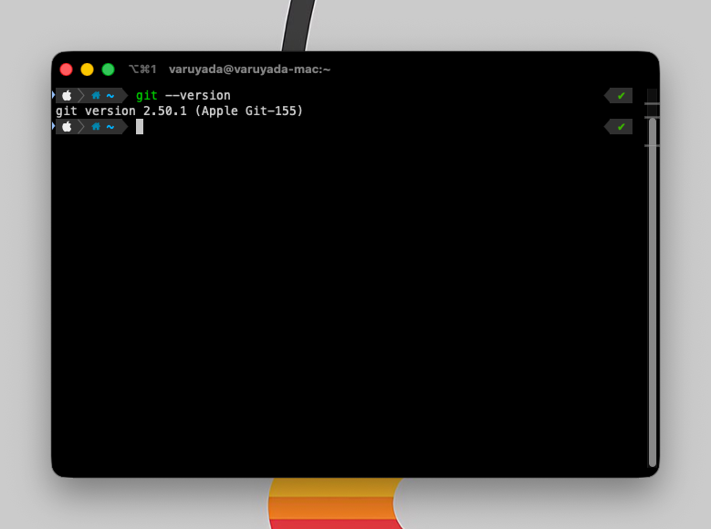

2. If Git is not installed, install it with Homebrew:

   ```bash
   brew install git
   ```

3. Verify the installation:

   ```bash
   git --version
   ```

<!-- Add image: Git installed successfully in macOS Terminal -->

---

## Task 3: Install Visual Studio Code

1. Download Visual Studio Code for macOS from [code.visualstudio.com](https://code.visualstudio.com/download).
2. Open the downloaded `.dmg` file.
   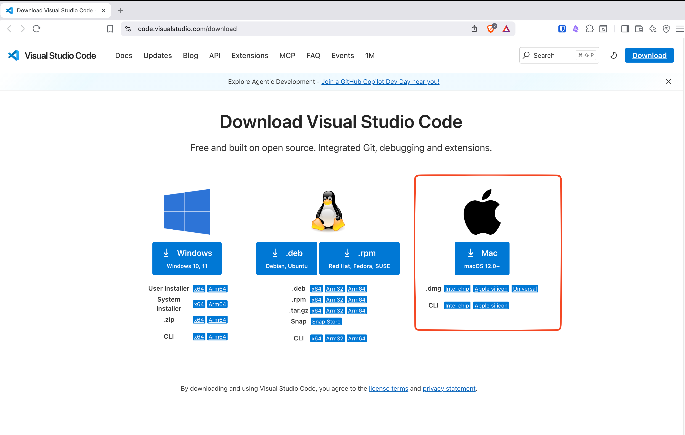
3. Drag **Visual Studio Code.app** into the **Applications** folder.
   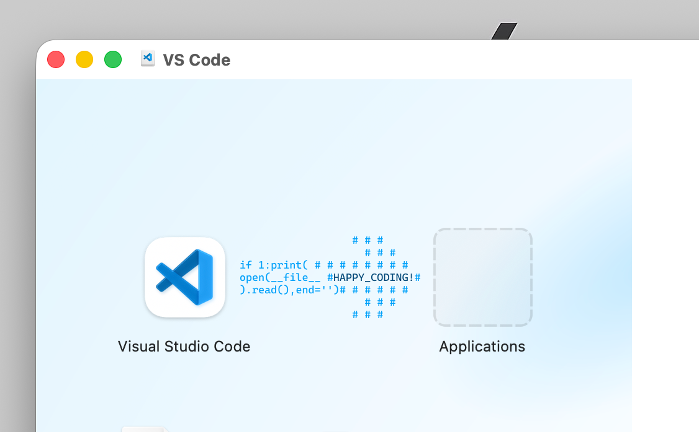
4. Launch VS Code from **Applications**.
   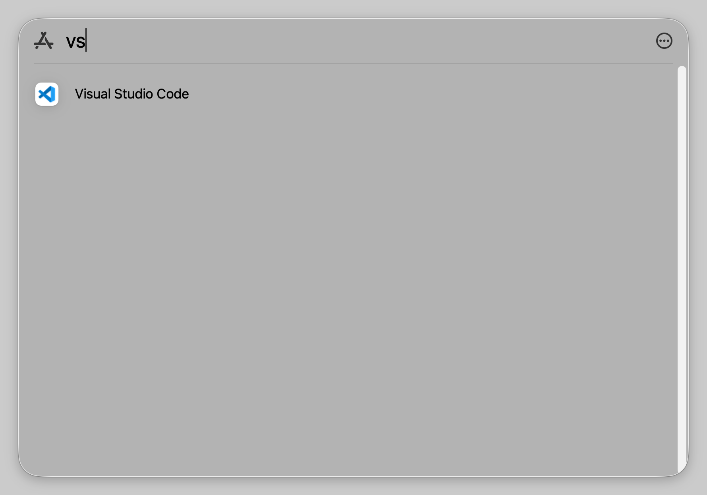
5. Optionally keep VS Code in your Dock for quick access.

---

## Task 4: Sign in to GitHub from VS Code

1. Open VS Code.
2. Click the **Accounts** icon on the left side of VS Code, and then click **Sign In**.
   
3. Select **Sign in with GitHub**.
   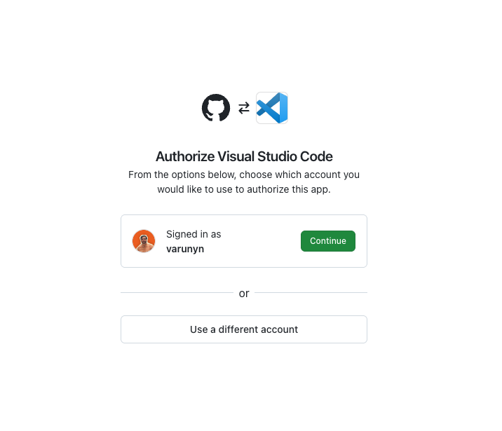
4. Complete the browser-based sign-in flow.
   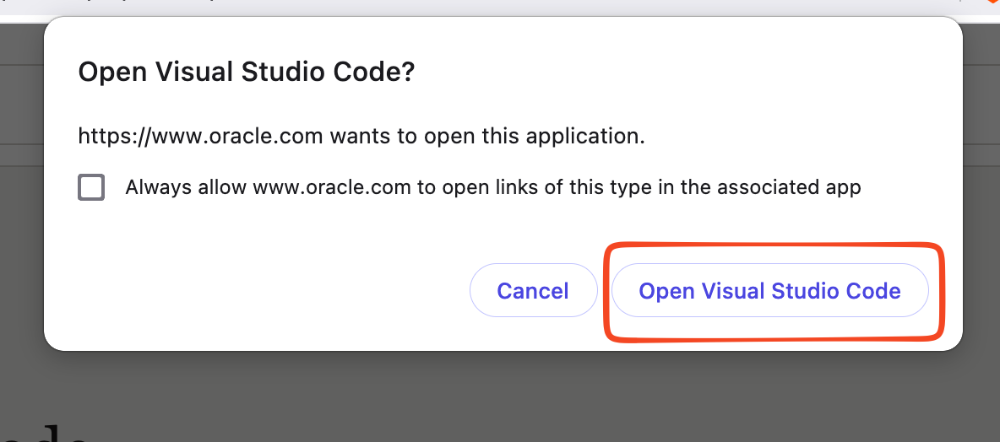
5. Return to VS Code and confirm your GitHub account is connected.

This sign-in is useful for source control workflows and for tools that integrate with GitHub from inside the IDE.

---

## Task 5: Install the SQL Developer extension in VS Code

1. Click this [link](https://www.oracle.com/database/sqldeveloper/vscode/), then click **Open in VS Code**.
   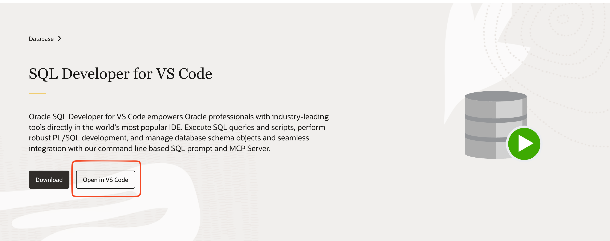
   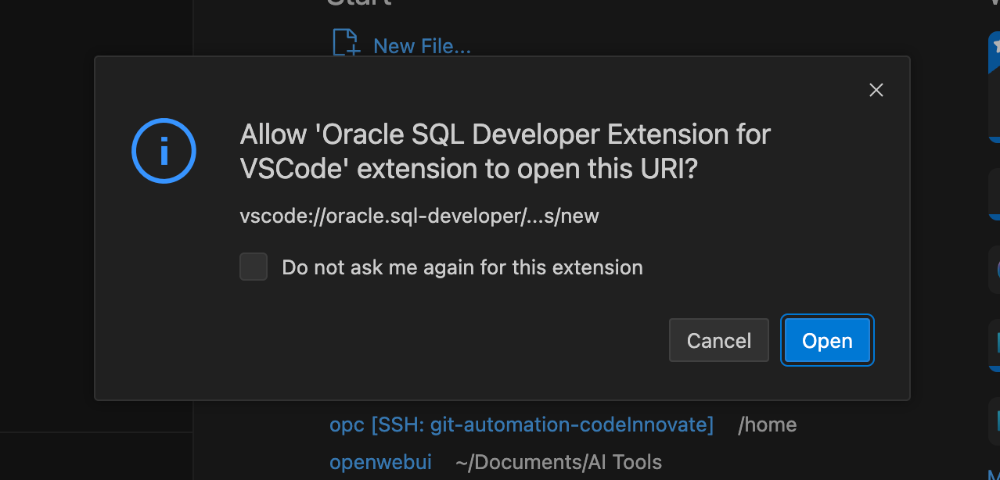

---

## Task 6: Request Oracle Code Assist Access in OIM

1. Sign in to [Oracle Identity Manager (OIM)](https://oim.oraclecorp.com/identity/faces/home). _VPN is required to open this link._
2. Select **Request Access**, then choose **Request for Self**.
   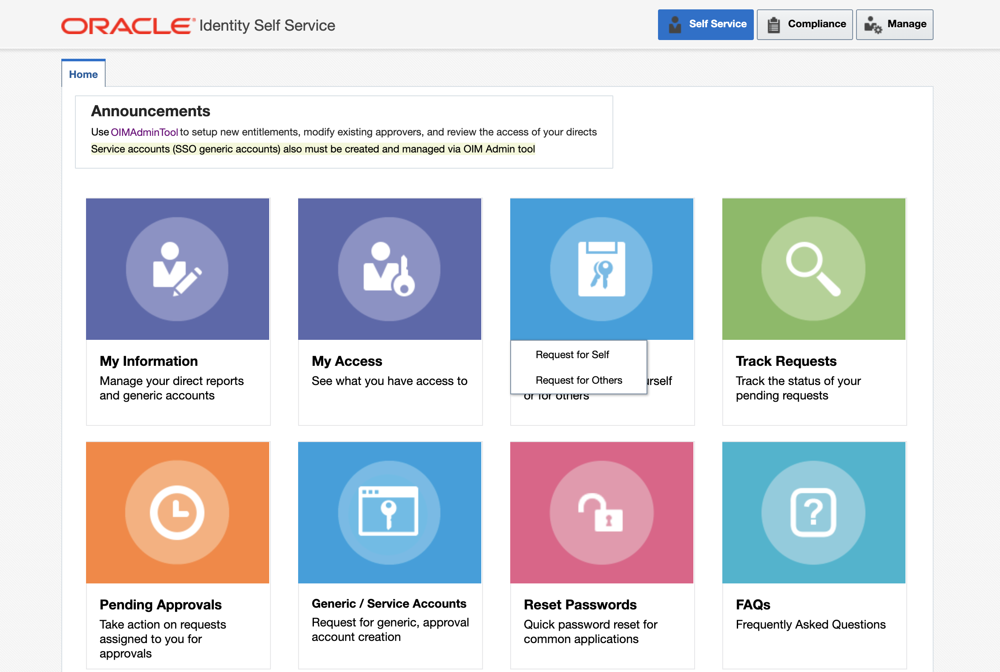
3. Open **Catalog** and search for the correct entitlement. If you do not see it, check whether it has already been assigned.
   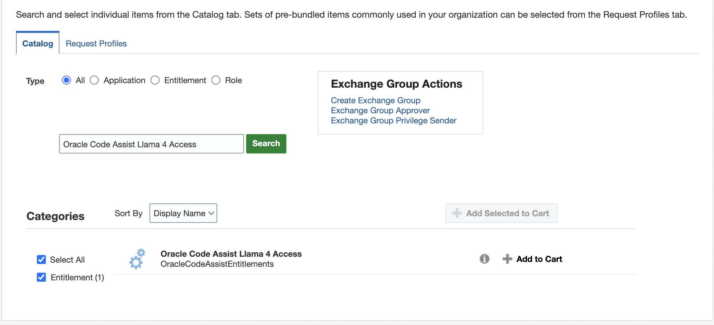
4. Select **Add to Cart**.
5. Select **Next**.
6. Enter your justification, select **Update**, and then select **Submit**.
7. Wait for manager approval.
8. After approval, allow about 15 minutes for the entitlement to become active.

---

## Task 7: Install Cline, Configure Oracle Code Assist, and SQLMCP

1. Follow this [link](https://marketplace.visualstudio.com/items?itemName=saoudrizwan.claude-dev) to install Cline from the VS Code Marketplace.
   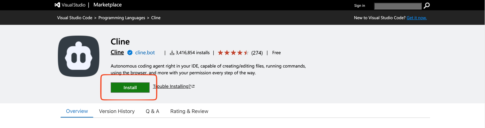
2. Open the **Cline** panel in VS Code. Click **Settings**, choose **Oracle Code Assist** as the API provider, select **I'm an Oracle Employee**, and then click **Sign in with Oracle Code Assist**.
   
3. Once signed in, choose the LLM model you want to use.
   
4. Press **Command+Shift+P** in VS Code to open the Command Palette.
   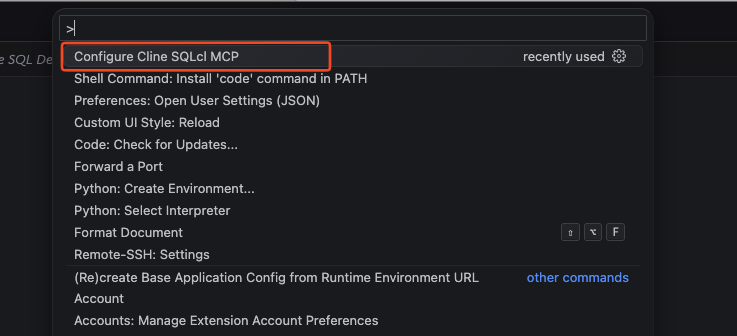
5. Search for **Configure Cline SQLcl MCP** and open it.
6. Open the Cline MCP configuration area.
   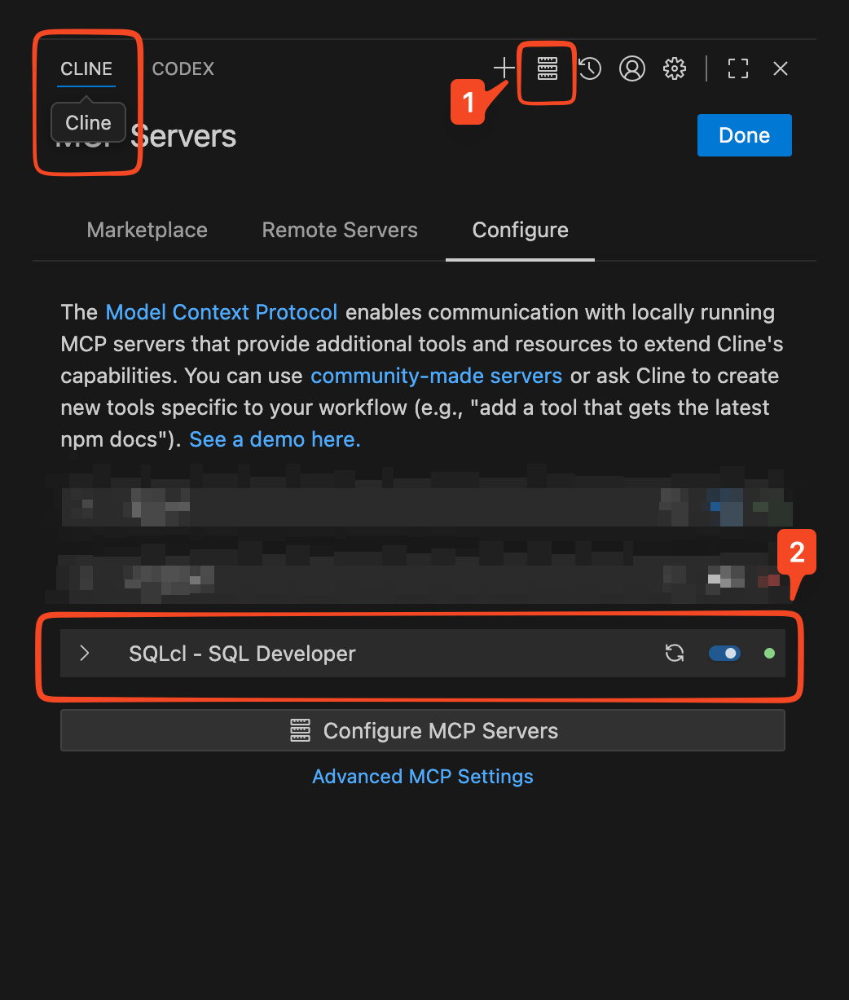
7. Review or enable the SQLcl - SQL Developer MCP configuration so that Cline can work with the SQL Developer extension.
   
8. Save the configuration.
9. Restart VS Code if required.
10. Verify that Cline can see and use the SQL Developer tooling.

---

## Task 8: Install Oracle Instant Client

Oracle Instant Client is required for tools and extensions that depend on Oracle client libraries.

1. Download the desired Oracle Instant Client packages for macOS from Oracle's download site. [Link](https://www.oracle.com/database/technologies/instant-client/downloads.html)
   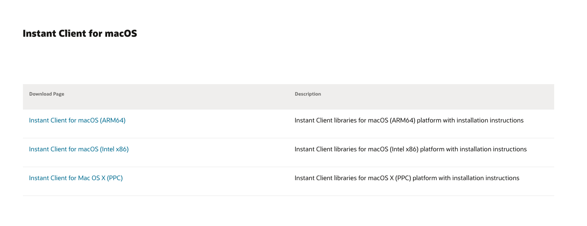 If this link doesn't open the download page try in incognito window

2. Download the DMG package you need, such as the basic package.
   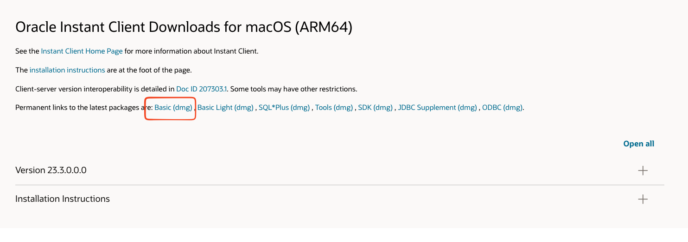

3. Expand the installation instructions section so you can review the package-specific steps.
   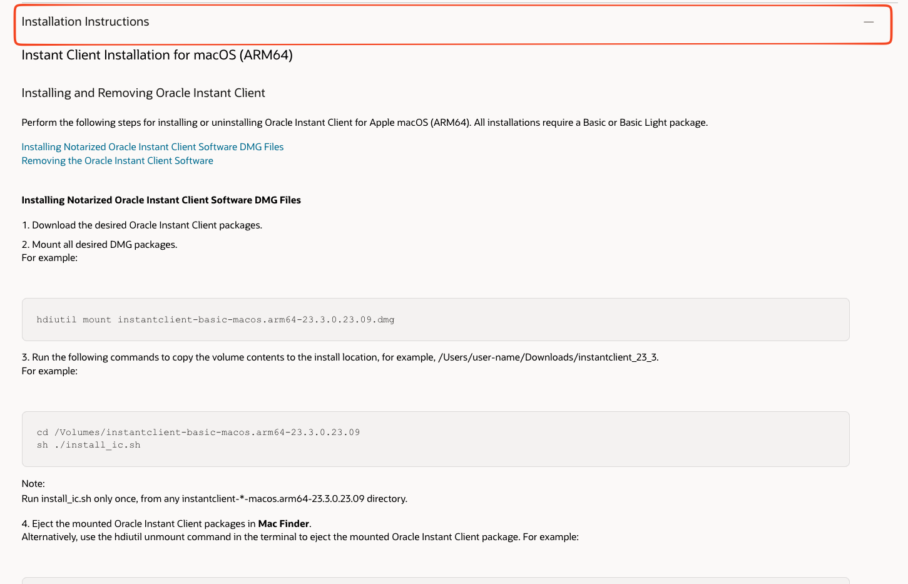

4. Mount each DMG package you want to install.

   ```bash
   hdiutil mount instantclient-basic-macos.arm64-23.3.0.23.09.dmg
   ```

   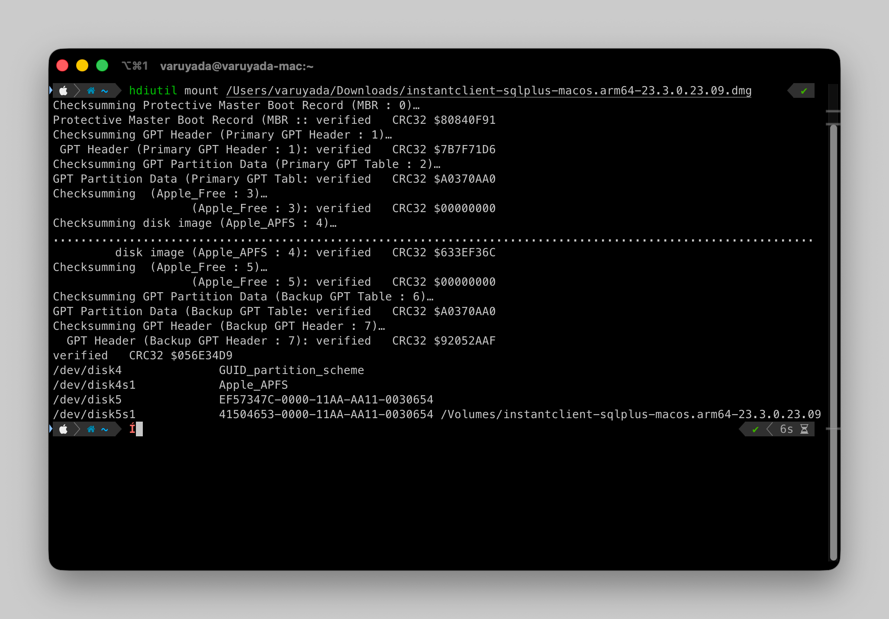

5. Change into the mounted volume and run the installer script to copy the files into your install location.

   ```bash
   cd /Volumes/instantclient-basic-macos.arm64-23.3.0.23.09
   sh ./install_ic.sh
   ```

   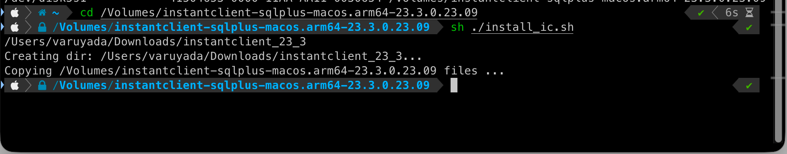

   Replace the example volume name with the package version you downloaded. By default, the installer copies the files into a folder such as `/Users/<your-user-name>/Downloads/instantclient_23_3`.

6. Restart your terminal session after updating your profile.

---

## Task 9: Install OCI CLI

1. Open Terminal.
2. Install the OCI CLI using [Homebrew](https://brew.sh/). Check the [documentation](https://docs.oracle.com/en-us/iaas/private-cloud-appliance/pca/installing-the-oci-cli.htm) for more information.

   ```bash
   brew install oci-cli
   ```

   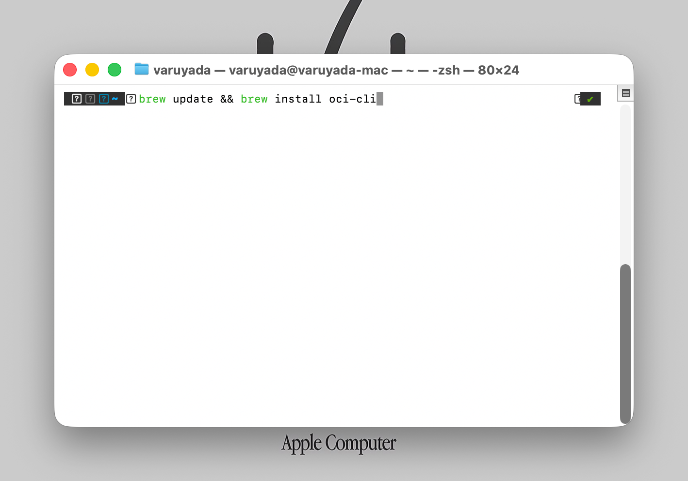

3. Verify the installation:

   ```bash
   oci --version
   ```

   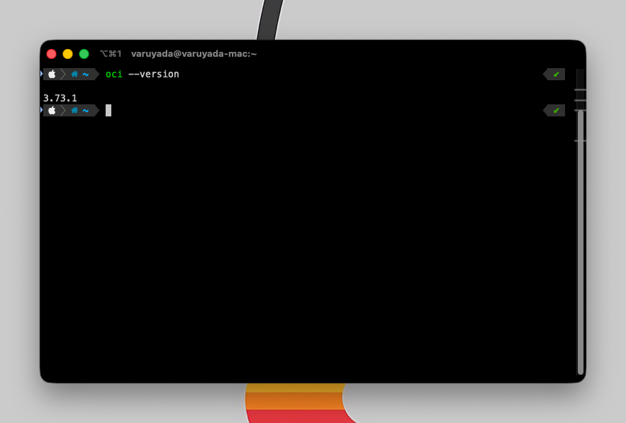

4. If needed, run the OCI CLI setup command. See this [quickstart link](https://docs.oracle.com/en-us/iaas/Content/API/SDKDocs/cliinstall.htm#configfile) for more details.

   ```bash
   oci setup config
   ```

   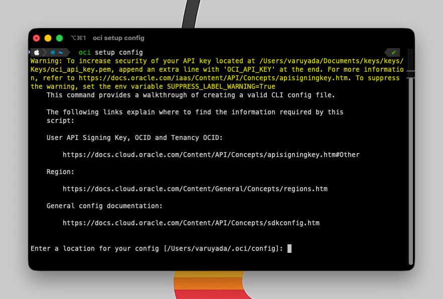

5. Complete the profile configuration using your OCI tenancy details.

---

## Task 10: Optional - Install Core Programming Languages

Install these if they are not already available on your machine.

### Python

1. Check whether Python 3 is already installed:

   ```bash
   python3 --version
   ```

2. If Python 3 is not installed, install it with [Homebrew](https://brew.sh/):

   ```bash
   brew install python
   ```

3. Verify the installation:

   ```bash
   python3 --version
   pip3 --version
   ```

4. If needed, upgrade to the latest Homebrew-managed version:

   ```bash
   brew upgrade python
   ```

### Node.js

1. Check your Node.js version:

   ```bash
   node -v
   ```

2. Install Node.js 22 or later with Homebrew:

   ```bash
   brew install node@22
   ```

3. If Homebrew prints follow-up instructions to add Node.js to your shell profile, run those commands, restart Terminal, and then verify the installation:

   ```bash
   node -v
   npm -v
   ```

---

## Task 11: Optional - Install and Set Up Codex

1. Open the [Codex download page](https://openai.com/codex/) in your browser and select **Download for macOS**.
   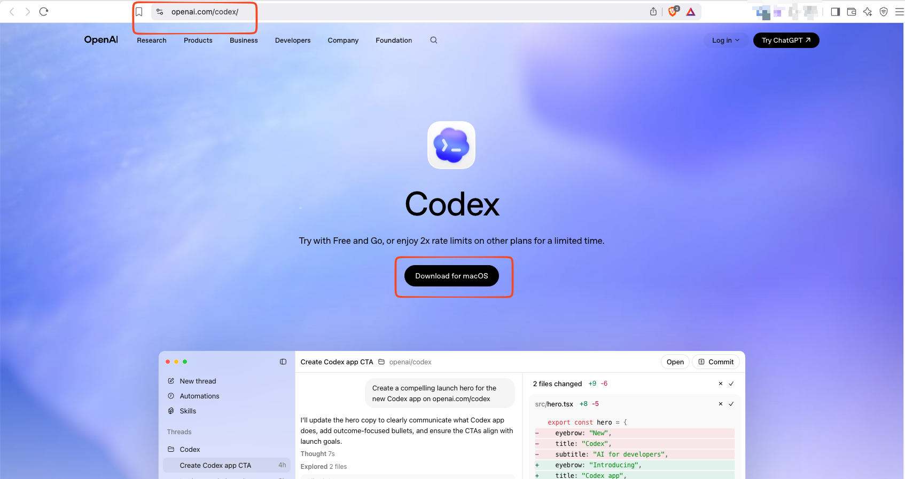

2. Open the downloaded installer and drag **Codex** into the **Applications** folder.
   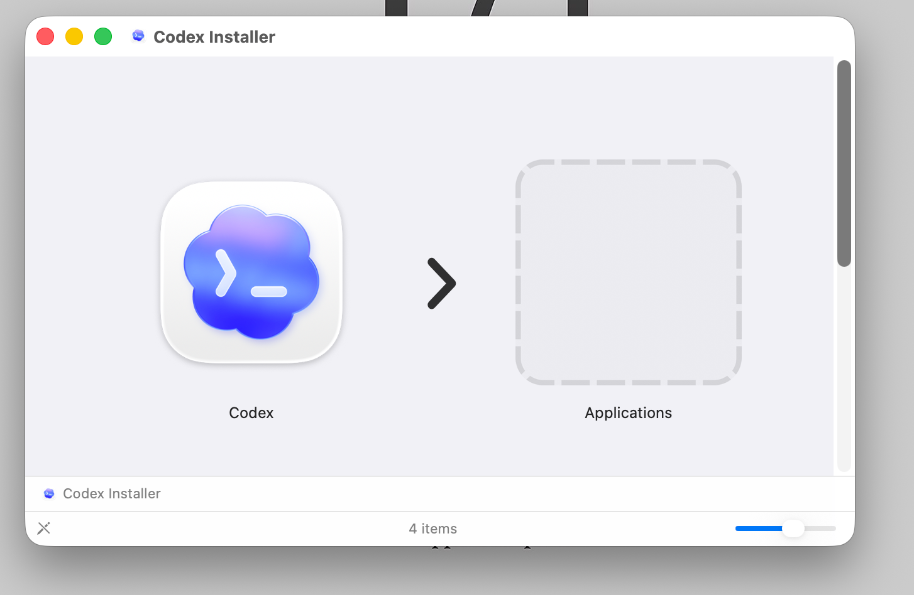

3. Open the [Oracle Code Assist API key page](https://apex.oraclecorp.com/pls/apex/r/oca/api-key/home) and copy the Codex environment setup command or API key details needed for your local setup.
   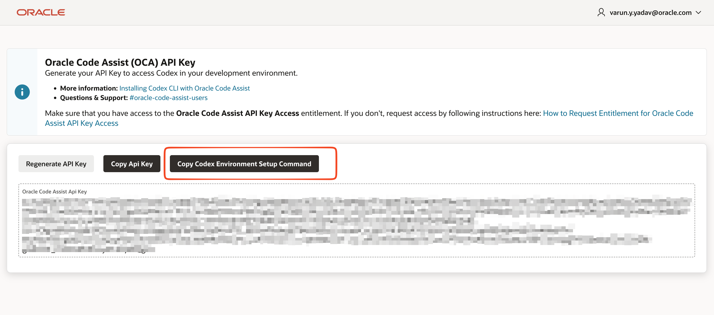

4. In Terminal, run the Codex setup or login flow and complete authentication with your Oracle Code Assist API key.
   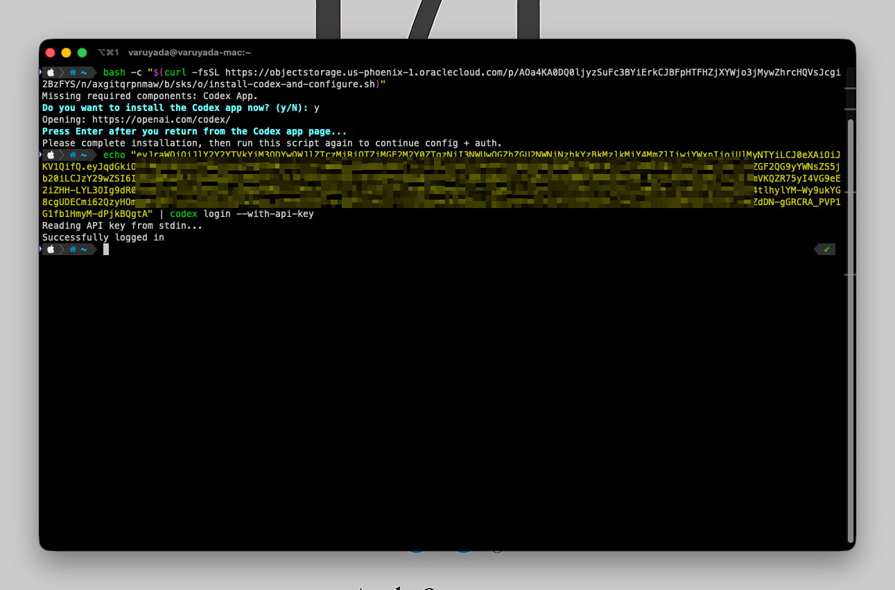

5. Launch Codex and verify that it opens successfully and responds to a prompt.
   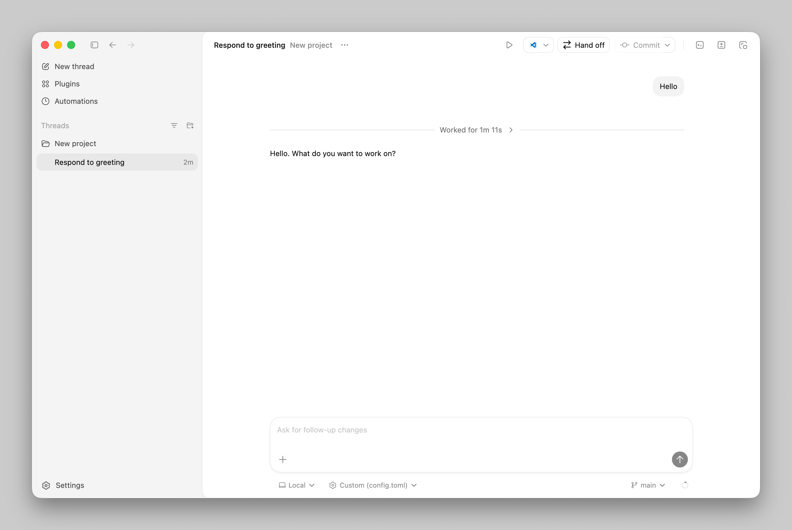

---

## Validation Checklist

Before moving on, confirm that:

- Git runs from Terminal
- Homebrew runs from Terminal
- VS Code opens correctly
- GitHub is connected in VS Code
- SQL Developer extension is installed
- Cline is installed and opens correctly
- Oracle Code Assist is installed
- Instant Client is available if required by your tooling
- OCI CLI is installed and responds in Terminal
- Optional Python and Node.js installations are available if needed
- Optional Codex installation opens and responds correctly if you chose to install it

---

## Next Steps

Once your Mac is ready, continue to the IDE-focused configuration and workshop labs.

---

## Acknowledgements

**Authors**

- **Varun Yadav**, Senior Cloud Engineer, ONA Developer Experience

**Contributors**

- **Cline AI**

**Last Updated By/Date:**

- **Generated for macOS setup draft**, March 2026
