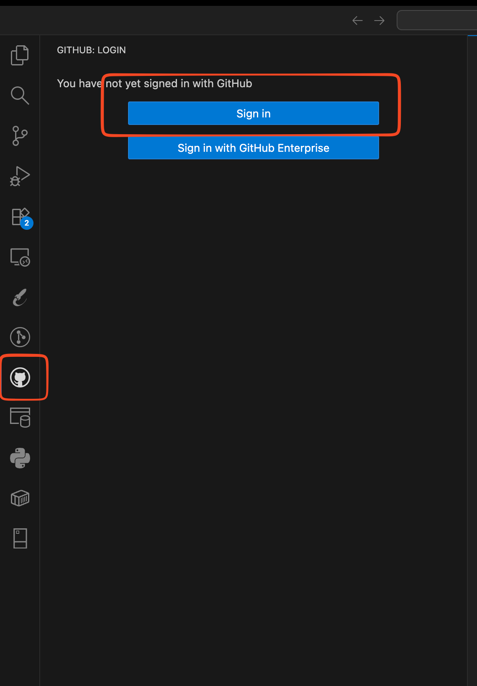

# Step 1: Local Machine Install and Setup for Cloud Vibe Code Development on macOS

## Introduction

This step prepares your Mac for the rest of the workshop. You will install the local tools needed for development, configure Visual Studio Code for Oracle and GitHub workflows, and validate that your machine is ready before moving on.

> **Estimated Time:** 30-45 minutes

---

### Objectives

In this step, you will:

- Install Git
- Install Visual Studio Code
- Configure the SQL Developer extension in VS Code
- Configure MCP in Cline for the SQL Developer extension
- Sign in to GitHub from VS Code
- Install and configure Oracle Code Assist
- Install and configure Cline
- Install Oracle Instant Client
- Request Oracle Code Assist access in OIM
- Install the OCI CLI
- Optionally install Python and Node.js

---

### Requirements

Before you begin, make sure you have:

- A Mac with local administrator access
- A stable internet connection
- An Oracle account for workshop access
- A GitHub account

---

## Task 1: Install Git

Git is required for cloning repositories, working with branches, and authenticating development workflows.

1. Check whether Git is already installed by opening the Terminal app and running:

   ```bash
   git --version
   ```

2. If Git is not installed, install it using one of these options:
   - Install Xcode Command Line Tools:
     ```bash
     xcode-select --install
     ```
   - Or download Git for macOS from [git-scm.com](https://git-scm.com/downloads/mac).

3. Verify the installation:

   ```bash
   git --version
   ```

<!-- Add image: Git installed successfully in macOS Terminal -->

---

## Task 2: Install Visual Studio Code

1. Download Visual Studio Code for macOS from [code.visualstudio.com](https://code.visualstudio.com/download).
2. Open the downloaded `.dmg` file.
   
3. Drag **Visual Studio Code.app** into the **Applications** folder.
   
4. Launch VS Code from **Applications**.
5. Optionally keep VS Code in your Dock for quick access.

<!-- Add image: VS Code installed in Applications folder -->

---

## Task 3: Sign in to GitHub from VS Code

1. Open VS Code.
2. Select the **Accounts** icon in the lower-left or upper-right area of the interface, depending on your layout.
   
3. Choose **Sign In**.
4. Select **Sign in with GitHub**.
   
5. Complete the browser-based sign-in flow.
   
6. Return to VS Code and confirm your GitHub account is connected.

This sign-in is useful for source control workflows and for tools that integrate with GitHub from inside the IDE.

---

## Task 4: Install the SQL Developer Extension in VS Code

1. Click on this [link](https://www.oracle.com/database/sqldeveloper/vscode/) and then click on **Open in VS Code**
   
   

---

## Task 5: Install Cline, Configure Oracle Code Assist and SQLcl MCP

1. Follow this [link](https://marketplace.visualstudio.com/items?itemName=saoudrizwan.claude-dev) to install Cline from VSCode marketplace
   
2. Open the **Cline** panel in VS Code. Click on settings, choose **Oracle Code Assist** as API Provider, check **I'm an Oracle Employee** and then click on **Sign in with Oracle Code Assist**
   
3. Once signed in Choose the llm model that you want to use.
   
4. Open the Cline MCP configuration area.
   
5. Add or enable the MCP configuration that allows Cline to work with the SQL Developer extension.
6. Save the configuration.
7. Restart VS Code if required.
8. Verify that Cline can see and use the SQL Developer tooling.

## Task 6: Install Oracle Instant Client

Oracle Instant Client is required for tools and extensions that depend on Oracle client libraries.

1. Download the appropriate Oracle Instant Client package for macOS from Oracle's download site. [Link](https://www.oracle.com/database/technologies/instant-client/downloads.html)
   

2. Download the basic dmg file by clicking on it.
   

3. Expand the Installation instruction section and follow the steps on how to install.
   

4. Restart your terminal session after updating your profile.

---

## Task 7: Request Oracle Code Assist Access in OIM

1. Open your organization's OIM access request portal.
2. Search for the Oracle Code Assist entitlement or access package.
3. Submit the access request.
4. Wait for approval before testing production use.
5. After approval, return to VS Code and complete sign-in if needed.

Document any internal approval notes or request names here if your team uses a specific package name.

<!-- Add image: OIM access request submitted -->

---

## Task 8: Install OCI CLI

1. Open Terminal.
2. Install the OCI CLI using your [Homebrew](https://brew.sh/). Check [documentation](https://docs.oracle.com/en-us/iaas/private-cloud-appliance/pca/installing-the-oci-cli.htm) for more info.

   ```bash
   brew update && brew install oci-cli
   ```

   

3. Verify the installation:

   ```bash
   oci --version
   ```

4. If needed, run the OCI CLI setup command:

   ```bash
   oci setup config
   ```

5. Complete the profile configuration using your OCI tenancy details.

---

## Task 9: Optional - Install Core Programming Languages

Install these if they are not already available on your machine.

### Python

1. Check your Python version:

   ```bash
   python3 --version
   ```

2. If needed, install a current Python 3 release using your preferred package manager or installer.
3. Confirm that `python3` and `pip3` are available.

### Node.js

1. Check your Node.js version:

   ```bash
   node -v
   ```

2. If needed, install `nvm` and then install Node.js:

   ```bash
   curl -o- https://raw.githubusercontent.com/nvm-sh/nvm/v0.40.4/install.sh | bash
   . "$HOME/.nvm/nvm.sh"
   nvm install 24
   ```

3. Confirm that both Node.js and npm are installed:

   ```bash
   node -v
   npm -v
   ```

---

## Validation Checklist

Before moving on, confirm that:

- Git runs from Terminal
- VS Code opens correctly
- GitHub is connected in VS Code
- SQL Developer extension is installed
- Cline is installed and opens correctly
- Oracle Code Assist is installed
- Instant Client is available if required by your tooling
- OCI CLI is installed and responds in Terminal
- Optional Python and Node.js installations are available if needed

---

## Next Steps

Once your Mac is ready, continue to the IDE-focused configuration and workshop labs.

---

## Acknowledgements

**Authors**

- **Varun Yadav**, Senior Cloud Engineer, ONA Developer Experience

**Contributors**

- **Cline AI**

**Last Updated By/Date:**

- **Generated for macOS setup draft**, March 2026
